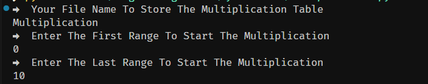

# multiplication
A Basic Multiplication Table Generator Within The Range Given By The User. It Will Generate The Table's File And Save it To a Folder. The File Name Will be the name of which number's it created the multiplication Table. 

# Usage 
```     Download it
        run **python -u multiplication.py** in the Terminal
        Enter The Name Of The Folder
        Enter The 1st range
        Enter The Second Range

```
# Example




# Contracts
[Instagram](https://www.instagram.com/tousif.nehal/) ;
[LinkTree](https://linktr.ee/tousifnehal)
# Enjoy :)